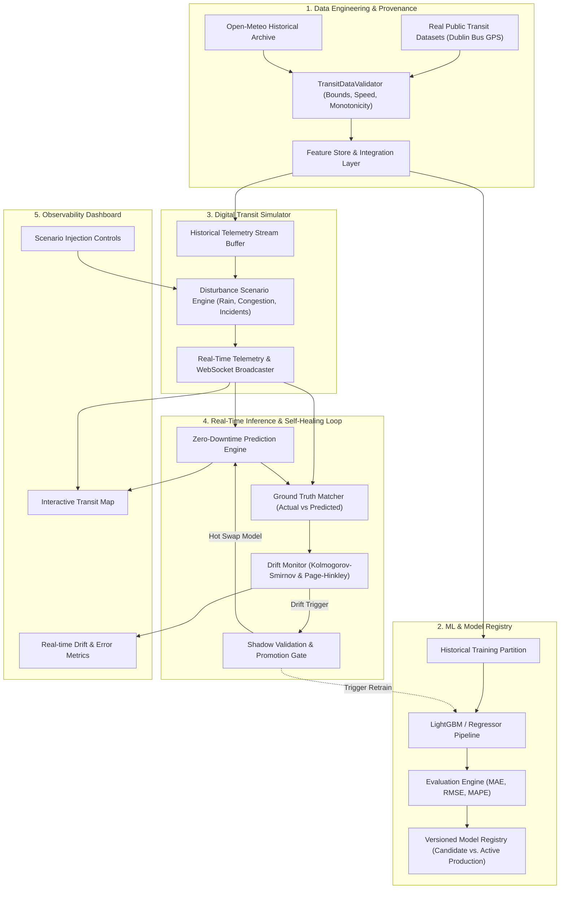

# TransitVision AI — High-Level System Architecture

TransitVision AI is an end-to-end, self-healing MLOps platform engineered for real-time bus arrival delay (ETA) prediction and automated concept-drift adaptation in dynamic public transportation networks.

---

## Core System Components

### 1. Data Engineering & Ingestion
- **Raw Immutable Zone (`data/raw/`)**: Stores untouched public datasets.
- **Validation Engine (`ml/data/validator.py`)**: Computes physical coordinate boundary, speed, and schema checks, generating structured audit reports.
- **Integration Engine (`ml/preprocessing/`)**: Merges transit AVL GPS telemetry with historical meteorological data and static GTFS stop topologies.

### 2. Digital Transit Simulator
- Replays historical AVL breadcrumbs at configurable speed multipliers ($1\times, 5\times, 10\times$).
- Injects controlled environmental and traffic disturbances (rush-hour surge, rainstorms, arterial accidents).
- Distinguishes strictly between real ingested telemetry and synthetic disturbance modifiers.

### 3. Real-Time Prediction Engine
- Ingests streaming bus GPS coordinates and computes instantaneous feature vectors.
- Produces sub-second ETA and arrival delay predictions.
- Supports zero-downtime hot-swapping of active model pointers during autonomous retraining.

### 4. Continuous Drift Detection & Self-Healing Retraining Loop
- **Statistical Data Drift**: Monitored per feature via two-sample Kolmogorov-Smirnov (KS) tests and Population Stability Index (PSI).
- **Concept Drift**: Monitored on prediction residuals ($|y_{\text{true}} - \hat{y}|$) via the Page-Hinkley test.
- **Automated Validation Gate**: Evaluates retrained candidate models against the active model on recent temporal validation windows before promoting to production.

### 5. Unified Configuration & APIs
- Centralized YAML configuration (`config/config.yaml`) controls all thresholds, learning rates, drift tolerances, and simulation speeds.
- Fast, asynchronous FastAPI backend exposing REST and WebSocket endpoints.
