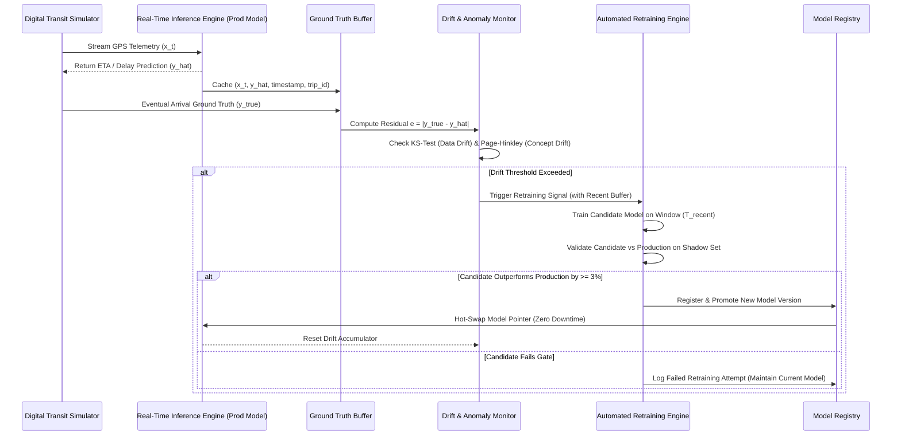

# TransitVision AI — MLOps & Self-Healing Platform Specification

This document details the continuous streaming architecture, drift detection statistical engines, shadow validation gates, and zero-downtime hot-swapping mechanisms.

---

## 1. Self-Healing Architecture Overview

---

## 2. Statistical Drift Detection Engines

### A. Data Drift (Covariate Shift)
- **Method**: Two-sample Kolmogorov-Smirnov (KS) test per numerical feature.
- **Null Hypothesis ($H_0$)**: The streaming window distribution equals the baseline reference distribution.
- **Trigger**: $p\text{-value} < 0.05$ across multiple core features (speed, congestion index, precipitation).

### B. Concept Drift (Conditional Shift $P(Y|X)$)
- **Method**: Sequential Page-Hinkley (PH) Test on prediction residuals $e_t = |y_t - \hat{y}_t|$.
- **Cumulative Deviation Variable**:
  $$m_t = \sum_{i=1}^{t} (e_i - \bar{e} - \delta)$$
  $$M_t = \min_{1 \le i \le t} m_i$$
  $$\text{PH}_t = m_t - M_t$$
- **Trigger**: $\text{PH}_t > \lambda$ (where $\lambda = 50$, configurable in `config.yaml`).

---

## 3. Shadow Validation & Promotion Gate

When drift triggers retraining:
1. Retraining pipeline loads the most recent operational sample window ($N=10,000$ points).
2. Fits candidate model $M_{\text{cand}}$.
3. Computes holdout validation metrics on both $M_{\text{prod}}$ and $M_{\text{cand}}$.
4. **Promotion Criterion**:
   $$\text{MAE}(M_{\text{cand}}) \le \text{MAE}(M_{\text{prod}}) \times (1 - \text{GATE\_PCT})$$
5. If passed, model is serialized, assigned an incremental version number, and promoted.

---

## 4. Zero-Downtime Hot-Swapping

- Inference engine utilizes an atomic memory reference pointer to the active model pipeline.
- Model reloading acquires a write lock solely for updating the reference pointer (taking $<1\text{ms}$), ensuring streaming requests never experience downtime, drops, or stalled connections.
